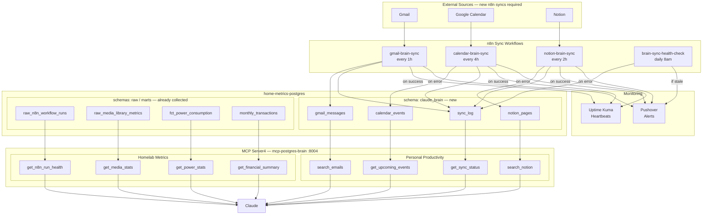

# Claude Brain — Architecture Diagram

```mermaid
flowchart TB
    subgraph ExtSources["External Sources — new n8n syncs required"]
        Gmail["Gmail"]
        GCal["Google Calendar"]
        Notion["Notion"]
    end

    subgraph SyncLayer["n8n Sync Workflows"]
        GmailSync["gmail-brain-sync\nevery 1h"]
        CalSync["calendar-brain-sync\nevery 4h"]
        NotionSync["notion-brain-sync\nevery 2h"]
        HealthCheck["brain-sync-health-check\ndaily 8am"]
    end

    subgraph MonitorLayer["Monitoring"]
        Kuma["Uptime Kuma\nHeartbeats"]
        Pushover["Pushover\nAlerts"]
    end

    subgraph PG["home-metrics-postgres"]
        subgraph BrainSchema["schema: claude_brain  —  new"]
            GM["gmail_messages"]
            CE["calendar_events"]
            NP["notion_pages"]
            SL["sync_log"]
        end
        subgraph ExistingSchemas["schemas: raw / marts  —  already collected"]
            NR["raw_n8n_workflow_runs"]
            MM["raw_media_library_metrics"]
            PC["fct_power_consumption"]
            MT["monthly_transactions"]
        end
    end

    subgraph Server4["MCP Server4 — mcp-postgres-brain  :8004"]
        subgraph PersonalTools["Personal Productivity"]
            T1["get_upcoming_events"]
            T2["search_emails"]
            T3["search_notion"]
            T4["get_sync_status"]
        end
        subgraph HomelabTools["Homelab Metrics"]
            T5["get_n8n_run_health"]
            T6["get_media_stats"]
            T7["get_power_stats"]
            T8["get_financial_summary"]
        end
    end

    Claude["Claude"]

    Gmail --> GmailSync
    GCal --> CalSync
    Notion --> NotionSync

    GmailSync --> GM
    GmailSync --> SL
    CalSync --> CE
    CalSync --> SL
    NotionSync --> NP
    NotionSync --> SL

    GmailSync -- on success --> Kuma
    CalSync -- on success --> Kuma
    NotionSync -- on success --> Kuma

    GmailSync -- on error --> Pushover
    CalSync -- on error --> Pushover
    NotionSync -- on error --> Pushover

    HealthCheck --> SL
    HealthCheck -- if stale --> Pushover

    CE --> T1
    GM --> T2
    NP --> T3
    SL --> T4
    NR --> T5
    MM --> T6
    PC --> T7
    MT --> T8

    T1 --> Claude
    T2 --> Claude
    T3 --> Claude
    T4 --> Claude
    T5 --> Claude
    T6 --> Claude
    T7 --> Claude
    T8 --> Claude
```
